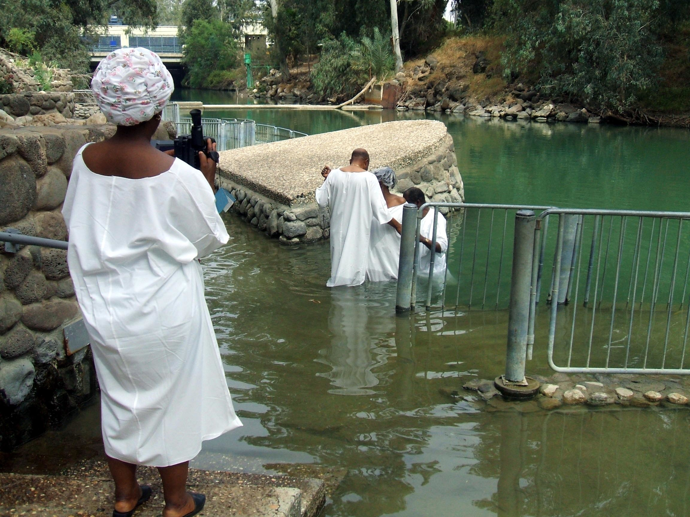

// depending on your npm version, you might need to override the default
// 'revealjsdir' value by removing the comments from the line below:
//:revealjsdir: node_modules/asciidoctor-reveal.js/node_modules/reveal.js

== Pickles

== Baptism

What do you picture?

== Baptism?

== Baptism

[NOTE.speaker]
--
- More powerful
- How could this change the way we look at the world?
- How could this change how the world sees us?
--

== John the Baptist

Did he establish water baptism?

[NOTE.speaker]
--
- Main reason we associate baptism with water
- Goes back to OT
- Tabernacle
--

== Washing & the Tabernacle

Heb 9:9-10 NKJV
_______________
It [was] symbolic for the present time in which both gifts and sacrifices are offered which cannot make him who performed the service perfect in regard to the conscience--
[concerned] only with foods and drinks, various washings, and fleshly ordinances imposed until the time of reformation.
_______________

[NOTE.speaker]
--
- Way of life: ordination and work
- Washing is baptism
--

== Ordination of a Priest

Exo 29:4 NKJV
________
And Aaron and his sons you shall bring to the door of the tabernacle of meeting, and you shall wash them with water.
________

[NOTE.speaker]
--
- Initial washing different
- Full body
- Baptized
- Ongoing washing
--

== Perpetual Work of a Priest

Exo 30:20 NKJV
______________
When they go into the tabernacle of meeting, or when they come near the altar to minister, to burn an offering made by fire to the LORD, they shall wash with water, lest they die.
______________

== Wash your hands or die!

[NOTE.speaker]
--
- Carried away
- Pharisees
--

== John the Baptist

"Why then do you baptize if you are not the Christ, nor Elijah, nor the Prophet?" (John 1:25)

[NOTE.speaker]
--
- Repentance, baptisms
- Washing is baptism
- Not water, but approach surprising
- Expected Elijah or Messiah
--

== Bethabara

image::baptism-of-jesus-bethabara.gif[www.bible-history.com,400]

[small]#Source: www.bible-history.com#

[NOTE.speaker]
--
- Joshua
- Elijah
--

== What was John doing?

Jhn 1:29-31
________________
The next day John saw Jesus coming toward him, and said, "Behold! The Lamb of God who takes away the sin of the world!
"This is He of whom I said, 'After me comes a Man who is preferred before me, for He was before me.'
"I did not know Him; but that He should be revealed to Israel, therefore I came baptizing with water."
________________

[NOTE.speaker]
--
- Lamb take away sins
- Christ was the sin offering
- How was going to sacrifice this Lamb?
--

== The Great High Priest

Heb 9:11-15
________________
But Christ came [as] High Priest of the good things to come, with the greater and more perfect tabernacle not made with hands ...
who through the eternal Spirit offered Himself without spot to God ...
And for this reason He is the Mediator of the new covenant
________________

[NOTE.speaker]
--
- Aaron foreshadows Christ
--

== The Ordination of Christ

Mat 3:14
________________
And John [tried to] prevent Him, saying, "I need to be baptized by You, and are You coming to me?"
________________

== Fulfilling all Righteousness

Mat 3:15
________________
But Jesus answered and said to him, "Permit [it to be so] now, for thus it is fitting for us to fulfill all righteousness." Then he allowed Him.
________________

[NOTE.speaker]
--
- Born, lived under law
- Fulfill
- "Ready to vanish away"
--

== The Ordination of a High Priest

[NOTE.speaker]
--
1. Washed in water
2. Clothed in priestly garments
3. Anointed with oil
--

== The Ordination of Christ

1. Washed in water by John
2. Anointed with Spirit by the Heavenly Father

[NOTE.speaker]
--
- Dove
- Voice
- Already righteous
--

== The Old and the New

1. Water: Fulfillment of the Old Covenant
2. Spirit: Firstfruits of the New Covenant

== The Work of Christ

Baptism of the Great High Priest

[NOTE.speaker]
--
- Baptisms not complete at Ordination
- James and John ask a favor
--

== Jesus replies to James and John

Mat 20:22
_________
"You do not know what you ask. Are you able to drink the cup that I am about to drink, and be baptized with the baptism that I am baptized with?"
_________

== The Baptism

Mat 20:27-28
____________
"And whoever desires to be first among you, let him be your slave--
just as the Son of Man did not come to be served, but to serve, and to give His life a ransom for many."
____________

[NOTE.speaker]
--
- Work unlike any other priest
- Lamb without blemish
- Still future
--

== The Cross

Luk 12:50
_________
"But I have a baptism to be baptized with, and how distressed I am till it is accomplished!"
_________

== Baptize: The Word

"baptize" (baptizo)

[NOTE.speaker]
--
Challenge:
- Washing in water OC
- Anointing in Spirit NC
- Work of Christ on Cross
--

== Baptize: The Dictionary

Vine's Expository Dictionary of New Testament Words
___________________________________________________
"to baptize," primarily a frequentative form of bapto, "to dip," was used among
the Greeks to signify the dyeing of a garment, or the drawing of water by
dipping a vessel into another, etc. Plutarchus uses it of the drawing of wine
by dipping the cup into the bowl (Alexis, 67) and Plato, metaphorically, of
being overwhelmed with questions (Euthydemus, 277 D).
___________________________________________________

[NOTE.speaker]
--
- Illustration from about 200BC
- Greek poet & physician Nicander
- Pickles illustrate of these two words
--

== Nicander on Pickles

1. Dip (bapto) in boiling water
2. Baptize (baptizo) in vinegar

== Pickles

What makes a pickle a pickle?

[NOTE.speaker]
--
- Watching baptism? Label? Taste?
- Water: perpetual washing under OC
- Spirit: permanent presence under NC
- Baptism Christ: extended beyond cross into life, gave Himself up
- Apostle Paul
--

== Paul on Baptism

1Co 1:17
_____________
For Christ did not send me to baptize, but to preach the gospel, not with wisdom of words, lest the cross of Christ should be made of no effect.
_____________

[NOTE.speaker]
--
- Focused on cross
- Water not foundational
- Spirit anointing not foundational
- Founded: baptism predated priests
--

== Baptized into Moses

1Co 10:1-2
_______________
Moreover, brethren, I do not want you to be unaware that all our fathers were under the cloud, all passed through the sea
all were baptized into Moses in the cloud and in the sea,
_______________

[NOTE.speaker]
--
- Dry ground, dry baptism
- Water, Spirit
--

== Baptized into Christ

Gal 3:27
_____________
For as many of you as were baptized into Christ have put on Christ.
_____________

== Baptized into His Death

Rom 6:3-6 NKJV
______________
As many of us as were baptized into Christ Jesus were baptized into His death
... our old man was crucified with [Him], that the body of sin might be done away with
______________

[NOTE.speaker]
--
- Baptized into Christ is baptized into His death
- Baptism/cross: coin
- Penticost after passover
--

== The Great Commission

believe + water baptism + Spirit baptism

== The Calling of Priest

baptized + washed + anointed

== Circumcision & Baptism

Col 2:8-14

== Circumcision without hands

Christ Died = I Died

== Baptism without hands

Christ Buried + Christ Raised = I was buried + I was raised

== The work of Christ

You are Complete in Christ

== Baptism

Foundational vs Vocational

== A New Calling

Eph 4: walk worthy of your vocation

== The Calling of the Soldier

1. Baptized (Eph 4)
2. Washed (Eph 5)
3. Armed (Eph 6)

== The Vocations

Soldier | Priest

== Baptism

How do we show this in our lives?

== The Cross

Gal 6:14
_____________
But God forbid that I should boast except in the cross of our Lord Jesus Christ, by whom the world has been crucified to me, and I to the world.
_____________

== Baptism

