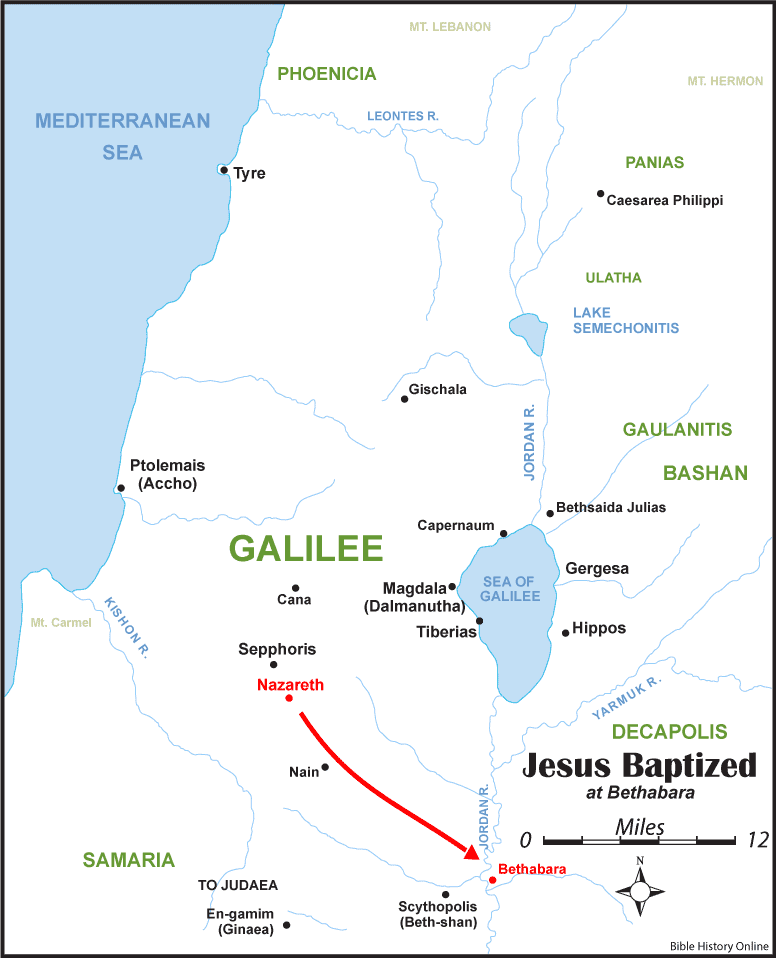

== Baptism
// depending on your npm version, you might need to override the default
// 'revealjsdir' value by removing the comments from the line below:
//:revealjsdir: node_modules/asciidoctor-reveal.js/node_modules/reveal.js

What do you picture?

== John the Baptist

Did he establish water baptism?

== Washing & the Tabernacle

Heb 9:9-10 NKJV
_______________
It [was] symbolic for the present time in which both gifts and sacrifices are offered which cannot make him who performed the service perfect in regard to the conscience--
[concerned] only with foods and drinks, various washings, and fleshly ordinances imposed until the time of reformation.
_______________

== "Washing" is "baptism"

These "various baptisms" were required for priests

== The Ordination of a Priest

Exo 29:4 NKJV
_____________
And Aaron and his sons you shall bring to the door of the tabernacle of meeting, and you shall wash them with water.
_____________

== The Work of a Priest

Exo 30:20 NKJV
______________
When they go into the tabernacle of meeting, or when they come near the altar to minister, to burn an offering made by fire to the LORD, they shall wash with water, lest they die.
______________

== Wash your hands or die!

== John the Baptist

"Why then do you baptize if you are not the Christ, nor Elijah, nor the Prophet?" (John 1:25)

== Bethabara

[small]#Source: www.bible-history.com#

== What was John doing?

Jhn 1:29-31 NKJV
________________
The next day John saw Jesus coming toward him, and said, "Behold! The Lamb of God who takes away the sin of the world!
"This is He of whom I said, 'After me comes a Man who is preferred before me, for He was before me.'
"I did not know Him; but that He should be revealed to Israel, therefore I came baptizing with water."
________________

== Revealing The Great High Priest

"who through the eternal Spirit offered Himself without spot to God" (Heb 9:11-15 NKJV)

== The Baptism of Christ

Mat 3:14 NKJV
________________
And John [tried to] prevent Him, saying, "I need to be baptized by You, and are You coming to me?"
________________

== Fulfill all Righteousness

Mat 3:15 NKJV
________________
But Jesus answered and said to him, "Permit [it to be so] now, for thus it is fitting for us to fulfill all righteousness." Then he allowed Him.
________________

== The Ordination of a High Priest

1. Wash in water
2. Put on priestly garments
3. Anoint with oil

== The Ordination of Christ

1. Washed in water
2. Anointed by the Spirit

== The Ordination of Christ

1. Water: Fulfillment of the Old Covenant
2. Spirit: Firstfruits of the New Covenant

== The Ordination of a Nation

1Pe 2:9 NKJV
____________
But you [are] a chosen generation, a royal priesthood, a holy nation, His own special people...
____________

== Another Baptism?

Luk 12:50 NKJV
______________
"But I have a baptism to be baptized with, and how distressed I am till it is accomplished!"
______________

== Jesus replies to James and John

Mat 20:22 NKJV
______________
"You do not know what you ask. Are you able to drink the cup that I am about to drink, and be baptized with the baptism that I am baptized with?"
______________

== Jesus replies to James and John

Mat 20:27-28 NKJV
______________
"And whoever desires to be first among you, let him be your slave--
just as the Son of Man did not come to be served, but to serve, and to give His life a ransom for many."
______________

== The Last Baptism of Christ

Foundational to His work as High Priest

== Baptize: The Word

"to dip" (bapto) vs to "baptize" (baptizo)

== Baptize: The Dictinary

Vine's Expository Dictionary of New Testament Words
___________________________________________________
"to baptize," primarily a frequentative form of bapto, "to dip," was used among
the Greeks to signify the dyeing of a garment, or the drawing of water by
dipping a vessel into another, etc. Plutarchus uses it of the drawing of wine
by dipping the cup into the bowl (Alexis, 67) and Plato, metaphorically, of
being overwhelmed with questions (Euthydemus, 277 D).
___________________________________________________

== Nicander on Pickles

1. Dip the vegetable in boiling water
2. Baptize the vegetable in vinegar

== Dill Pickles

What makes a dill pickle a dill pickle?

== Paul on Baptism

1Co 1:17 NKJV
_____________
For Christ did not send me to baptize, but to preach the gospel, not with wisdom of words, lest the cross of Christ should be made of no effect.
_____________

== Baptized into Christ

For as many of you as were baptized into Christ have _put on_ Christ.
(Gal 3:27 NKJV)

== Baptized into His Death

Rom 6:3-4 NKJV
______________
Or do you not know that as many of us as were baptized into Christ Jesus were baptized into His death?
Therefore we were buried with Him through baptism into death, that just as Christ was raised from the dead by the glory of the Father, even so we also should walk in newness of life.
______________

== Crucified with Him

Rom 6:5-6 NKJV
______________
For if we have been united together in the likeness of His death, certainly we also shall be [in the likeness] of [His] resurrection,
knowing this, that our old man was crucified with [Him], that the body of sin might be done away with, that we should no longer be slaves of sin.
______________

== Baptism and The Cross

"Or do you not know that as many of us as were _baptized_ into Christ Jesus were _baptized_ into His death?
... our old man was _crucified_ with [Him], that the body of sin might be done away with"

== Complete in Christ

Col 2:10-12 NKJV
________________
and you are complete in Him, who is the head of all principality and power.
In Him you were also circumcised with the circumcision made without hands, by putting off the body of the sins of the flesh, by the circumcision of Christ
buried with Him in baptism, in which you also were raised with [Him] through faith in the working of God, who raised Him from the dead.
________________

== Circumcision without hands

Christ Died = I Died

== Baptism without hands

Christ Buried + Christ Raised = I was buried + I was raised

== You are Complete in Christ

== Baptism and The Cross

Gal 6:14 KJV
____________
But God forbid that I should glory, save in the cross of our Lord Jesus Christ, by whom the world is crucified unto me, and I unto the world.
____________

== The One Baptism

Eph 4:4-6 KJV
_____________
[There is] one body, and one Spirit, even as ye are called in one hope of your calling;
One Lord, one faith, one baptism,
One God and Father of all, who [is] above all, and through all, and in you all.
_____________

== The Cross

Eph 2:14-16 NKJV
________________
For He Himself is our peace, who has made both one, and has broken down the middle wall of separation,
having abolished in His flesh the enmity, [that is], the law of commandments [contained] in ordinances, so as to create in Himself one new man [from] the two, [thus] making peace,
and that He might reconcile them both to God in one body through the cross, thereby putting to death the enmity.
________________

== The New Person

anthropos => human being, whether male or female

== The Old vs The New

old creation | new creation
old anthropos | new anthropos
Adam | Christ

== The Calling of a Priest

Bullet list

== The Calling of the Soldier

Bullet list

== The Calling of a Husband & Soldier

== What defines a Follower of Christ

The Great Commission? Penticost? Your calling?

== A Follower of Christ

How do you identify one?

== A Follower of Christ

Mar 8:34 KJV
____________
And when he had called the people [unto him] with his disciples also, he said unto them, Whosoever will come after me, let him deny himself, and take up his cross, and follow me.
____________

== The Body of Christ

Col 3:3 NKJV
____________
For you died, and your life is hidden with Christ in God.
____________

== The Cross

Gal 6:14 NKJV
_____________
But God forbid that I should boast except in the cross of our Lord Jesus Christ, by whom the world has been crucified to me, and I to the world.
_____________

The cross meant that Paul looked different to the world.

== Baptism

Image of the Cross
